# SPRINT 1

Nesta primeira Sprint nos foi proposto o desafio com o objetivo de **praticar comandos de Linux e Markdown**. Esse é o cerne do desafio, e para atingí-lo
recorremos ao expediente que consiste resumidamente em criar um script executável que processa os dados contidos em um arquivo csv gerando outros arquivo, esse script deve ser executado automaticamente mediante um agendamento programado. O que esse script faz e o passo a passo serão descritos mais adiantes neste mesmo texto.

# Evidências

## Etapa 1: Preparação para realização do desafio 

### Etapa 1.1 
Comecei o desafio tomando ciência de cada detalhe a se fazer. Acessei a trilha, li as primeiras intruções e fiz o download do template exemplo e do arquivo dados_de_vendas.csv. 

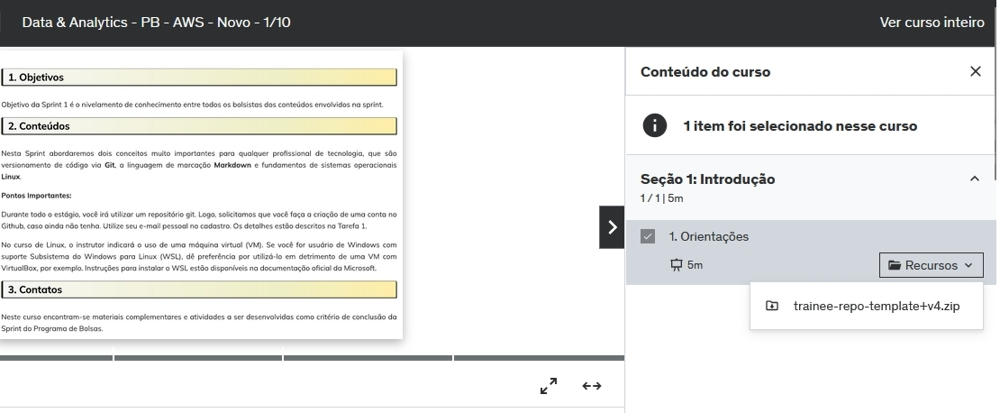

### Etapa 1.2
Em seguida foi tomado conhecimento do passo a passo do desafio, e em seguida fiz o download do arquivo dados_de_vendas.csv

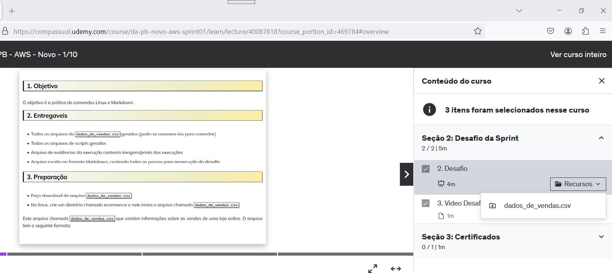

### Etapa 1.3
Abaixo, a imagem que mostra os arquivos baixados.

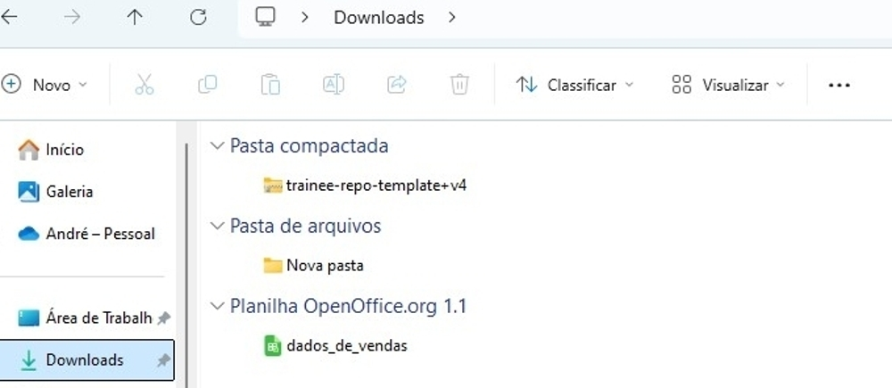

### Etapa 1.4
Nesta fase, enquanto assistia os vídeos da trilha, aproveitei para começar a esboçar um fluxograma do script, de forma simples. Como é uma linguagem de script, e teoricamente eu não usaria laços ou condicionais, agilizaria muito o trabalho.

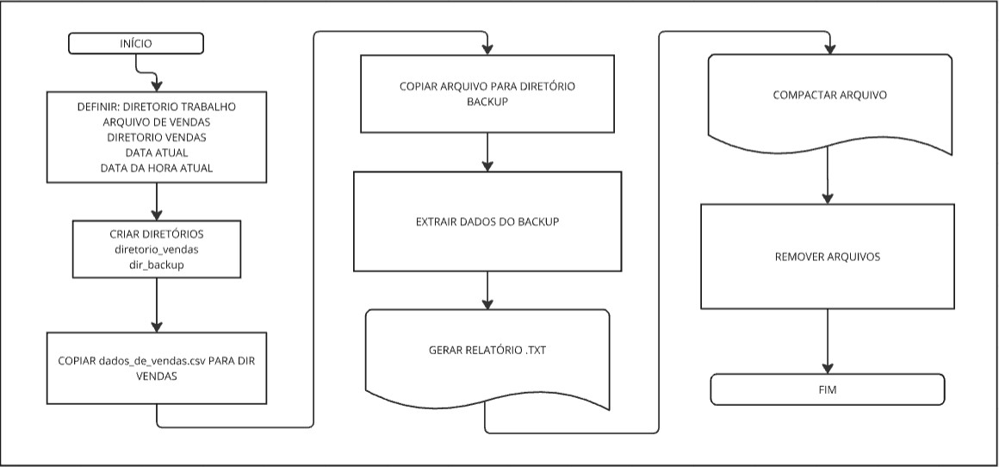

## Etapa 2: Da criação dos arquivos  

### Etapa 2.1
Comecei a elaborar o desafio no linux, utilizando uma VM com a distro Arch.

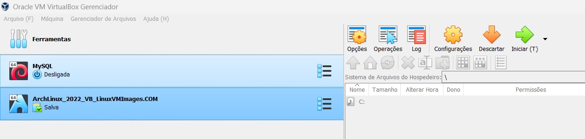

### Etapa 2.2

Fiz um primeiro teste com o crontab com o esboço do script, que nessa fase apenas criava um relatorio.txt simples com a data coletada no dia.

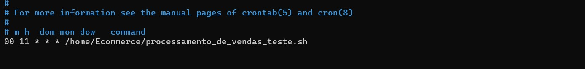

### Etapa 2.2
Como muito colegas preferiram usar WSl com o Ubuntu, e eles relataram dificuldades, decidi fazer tudo no WSl de modo a auxiliá-los na atividade. Abaixo a imagem já no WSL. Nessa etapa já movi o dados_de_vendas.csv para a pasta Ecommerce e aproveitei para poupar trabalho criando (mas sem o código ainda) o arquivo processamento_de_vendas.sh pelo terminal mesmo.

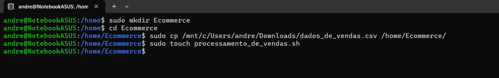

### Etapa 2.3
Ao testar o crontab nessa pasta, ele não funcionava de modo que o script funcionassse nesta pasta, procurei se talvez ele estivesse funcionando e criando arquivos em outros lugares e achei. 

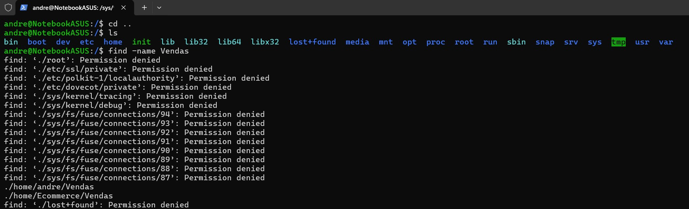

### Etapa 2.4
Para evitar perder tempo com mais configurações e procurar ou adicionar autorizações em pastas ou arquivos, resolvi mudar tudo para dentro de um subdiretório em  **/home/andre/**

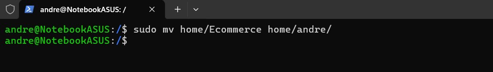

### Etapa 2.5
Com o script criado via terminal, construi o código do script com a ajuda do VS Code. Demorei cerca de 5 dias para criar, retificar erros para um resultado que atendesse o mínimo requisitado pelo desafio.

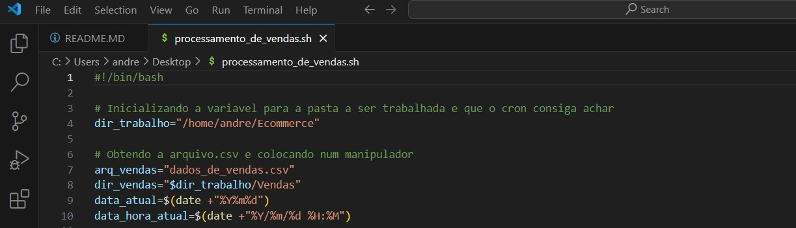

### Etapa 2.6
Gostaria de destacar 2 trechos do meu código. Este foi o mais difícil. Apesar de comandos em Linux puro e no WSl não serem muito diferentes, existem pequenas diferenças que me foram muito trabalhosas para conseguir executar corretamente o objetivo do desafio.  

***Etapa 2.6.1***
Neste trecho, a sintaxe de tail e cut é a mesma tanto no WSL quanto no Linux puro, mas a forma como elas trabalham difere.. Ao usar o diretório padrão do WSl para configurar minha variável de inicialização (dir_trabalho="/mnt/c/Usersandre/"), percebi uma certa lentidão e também problemas com "denied acess". Pesquisando por esse problema, descobri que esse diretório é nativo do WSL. Para evitar maiores problemas, decidi usar um diretório Linux nativo para configurar minhas variáveis (dir_trabalho="/home/andre/Ecommerce").

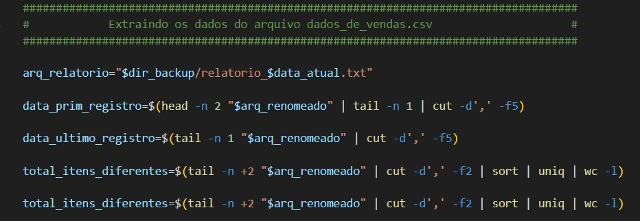

## Etapa 3: Agendamento da execução

### Etapa 3.1
Utilizei o comando journalctl para conferir as execuções do crontab e como ele se comportava.

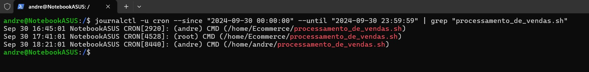

### Etapa 3.2
Com tudo pronto e arquivos posicionados, é hora de agendar a execução do crontab chamando-o com crontab -e.

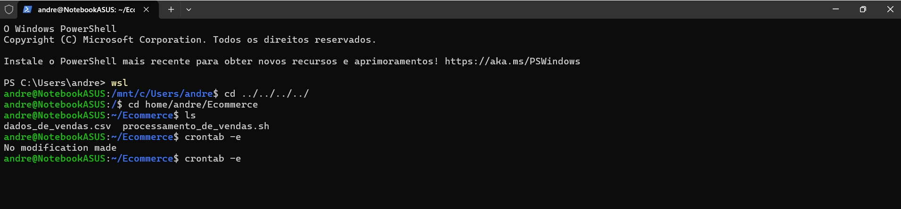

### Etapa 3.3
Na imagem abaixo, faço o agendamento do crontab. Utilizo a sintaxe "27 15 * * * /home/andre/Ecommerce/processamento_de_vendas.sh", sintaxe que significa que as 15:27 de qualquer dia e mês e semana ele executará o arquivo .sh indicado.

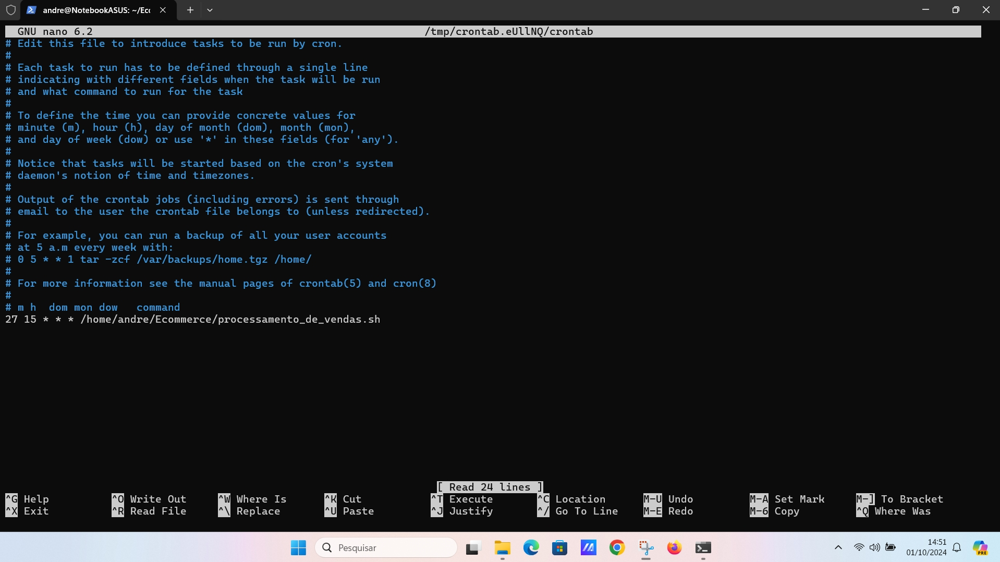
  
## Etapa 4: Sobre os dias com as execuções do script

Com o objetivo de não ser redundante nesta etapa, mostrarei a execução apenas do dia 01/10/24, os outros 3 dias estão respecitvamente na pasta Etapa_04/Dia_02-10-24, Etapa_04/Dia_03-10-24 e Etapa_04/Dia_02-10-24.

### Etapa 4.1
Dia 01/10/2024 executado o 1o dia do script, imagem do diretório com os respectivos arquivos e logo a seguir a imagem de log da execução do processmento_de_vendas.sh

Imagem abaixo mostrando que a pasta "Vendas" gerada.

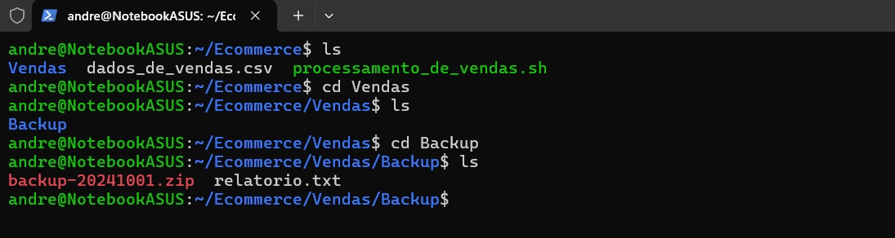

Imagem abaixo mostrando o arquivo syslog com os log de execução do crontab.

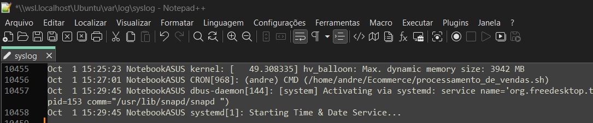

### Etapa 4.2
Logo a seguir da execução do dia 01/10/24, modifiquei completamente o arquivo dados_de_vendas.csv para seguir com a execução nos outros dias.

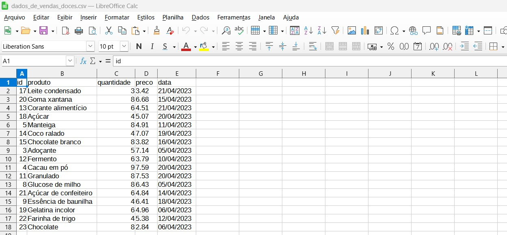

## Etapa 5: Arquivos resultantes da execução do script

Sobre os arquivos produzidos pelo script. Com o intuito de não ser redundante, aqui mostro a execução do ultimo dia, com todos os arquivos produzidos.

### Etapa 5.1
Árvore para mostrar melhor os arquivos produzidos

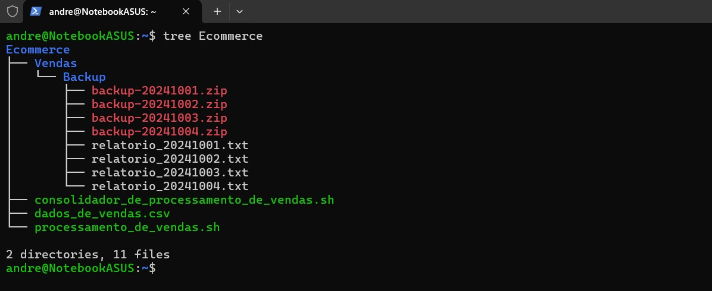

## Etapa 6: Compilação dos relatórios diários em um final

Nesta estapa finalizei o desafio com a última tarefa que consiste em criar outro script.sh, com o objetivo de compilar os 4 relatórios produzidos durante os quatro dias.

### Etapa 6.1
Trecho do código do script consolidador_de_processamento_de_vendas.sh

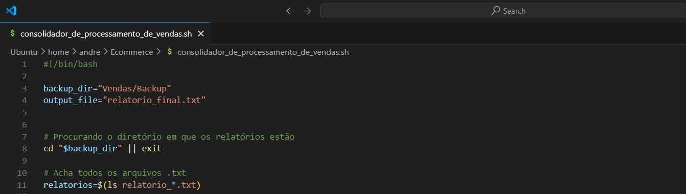

### Etapa 6.1
Gostaria de destacar esse trecho do código. Enfrentei muita dificuldade para elaborar alguma saída razoável para poder colocar a data do primeiro/último registro dentre os quatro relatórios. Os resultados sempre recaiam em colocar, por exemplo, as 4 datas do primeiro/último rgistro no relatorio_final.txt. Com a ajuda do chat gpt foi elaborado um laço for com condicionais if fi. O grosso desse trecho é todo do chat gpt. Apenas configurei detalhes como tail, cut e grep.

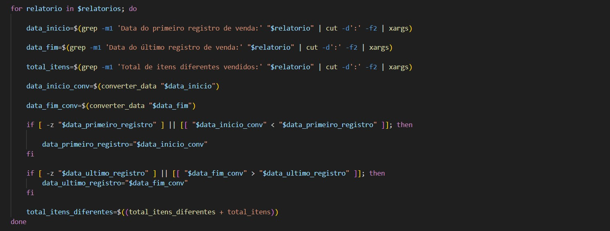

### Etapa 6.2
Nesta etapa tive um problema que considerei relevante. Meu script deveria colocar juntos as 10 primeiras linhas consideradas em cada relatorio. Mas essa parte do relatorio_20241001.txt não aparecia.

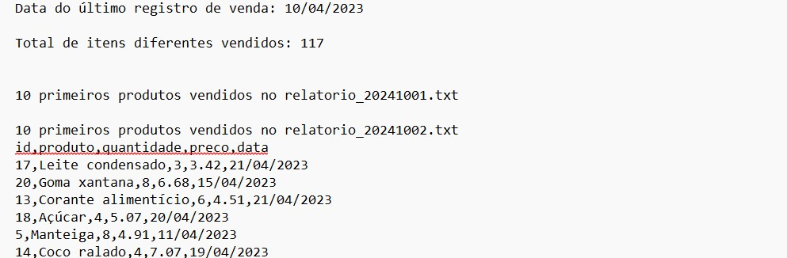

### Etapa 6.3
Descobri que no arquivo que foi baixado da trilha, dados_de_vendas.csv, a quarta coluna está escrita como "preço". Após a execução do primeiro dia, como pedido nas instruções do desafio, eu refiz completamente do zero um novo dados_de_vendas.csv, e escrevi a quarta coluna como preco. 

Resolvi esse problema trocando manualmente "preço" por preco no relatorio_20241001.txt. Em seguida executei o consolidador_de_processamento_de_vendas.sh e o relatorio_final.txt saiu corretamente preenchido.

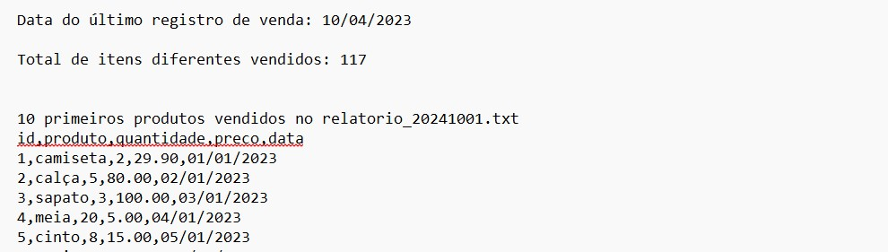

## Etapa 7: Encerramento

Com esta etapa encerro o presente documento. Abaixo, a imagem mostrando o diretório, subdiretórios e os arquivos produzidos.

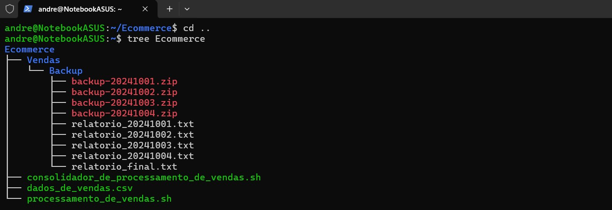

## Etapa 8: Bibliografia

O curso oferecido pela trilha não foi suficiente para executar o desafio. Então usei outros sites, livros e cursos.

Linux Bible de Christopher Negus 

https://compassuol.udemy.com/course/programacao-shell-script/

https://www.shellscriptx.com/2016/12/estrutura-condicional-if-then-elif-else-fi.html

https://bash.cyberciti.biz/guide/If..else..fi

https://imasters.com.br/desenvolvimento/bash-for-loop-primeiro-passo-na-automacao-no-linux

https://chatgpt.com/

# Exercícios

Não aplicável a esta sprint.

# Certificados

Não aplicável a esta sprint.

