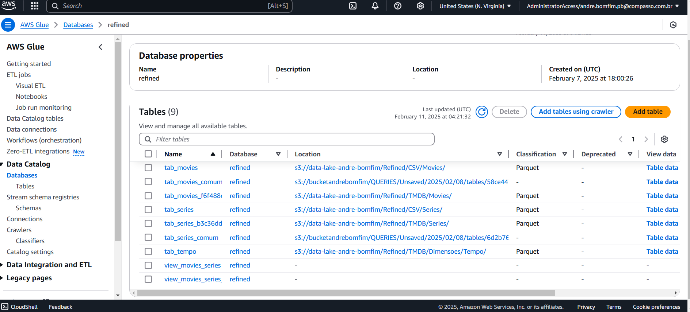
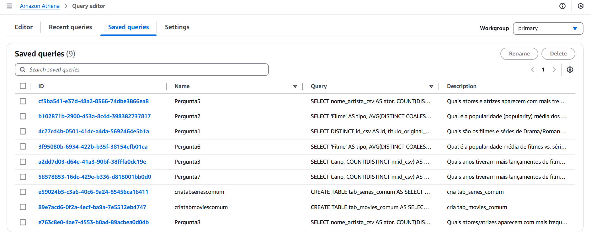
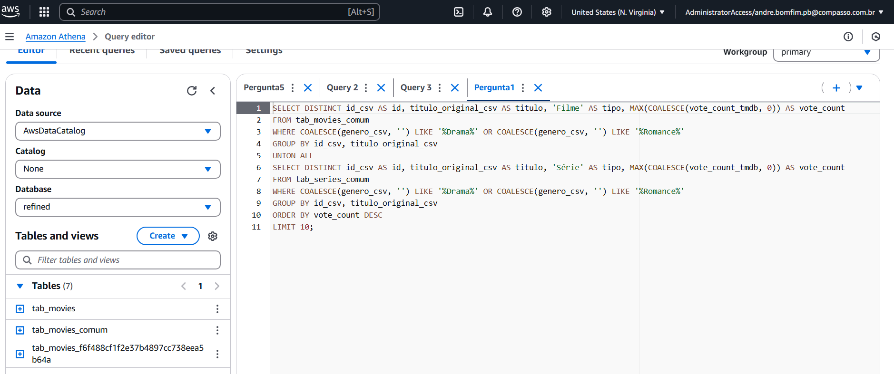
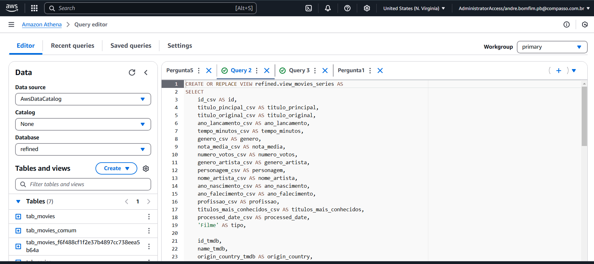
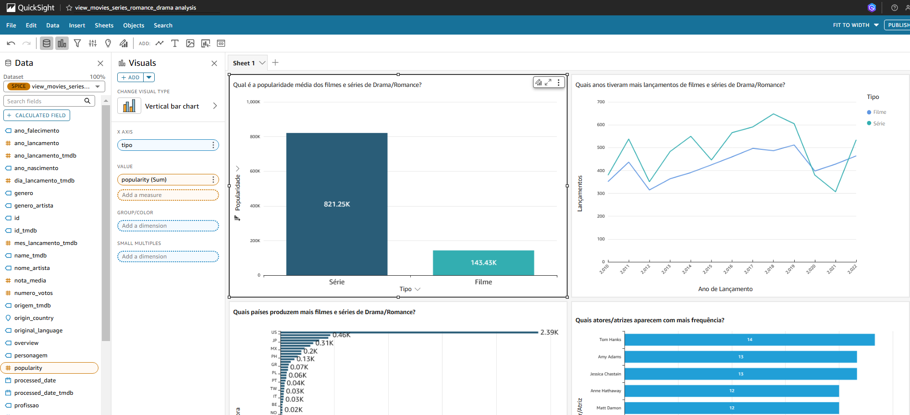

# DESAFIO SPRINT 10

#### Nesta sprint concluí um ciclo de análise de dados e visualização em um dashboard baseado nas últimas quatro sprints. Aqui validei insights e revisei os dados para verificar se há padrões ou tendências relevantes.

#### Para a minha análise final foram selecionadas 6 perguntas.

 #### Perguntas da Análise Geral de Filmes e Séries de Drama/Romance:

🔹 Quais são os filmes e séries de Drama/Romance mais votados?

🔹 Qual é a popularidade média dos filmes e séries de Drama/Romance?

🔹 Quais anos tiveram mais lançamentos de filmes e séries de Drama/Romance?

🔹 Quais países produzem mais filmes e séries de Drama/Romance?

🔹 Quais atores/atrizes aparecem com mais frequência?

🔹 Qual é a nota média de filmes vs. séries?

#### Etapa 1: Tabelas criadas

#### Etapa 2: Querys das perguntas e views

#### Etapa 3: Um exemplo de código da pergunta

#### Etapa 4: Criação da View

#### Etapa 5: Dashboard criado

#### Etapa 6: Códigos

[Código Pergunta 1](../DESAFIO/pergunta1.sql)

[Código Pergunta 2](../DESAFIO/pergunta2.sql)

[Código Pergunta 3](../DESAFIO/pergunta3.sql)

[Código Pergunta 5](../DESAFIO/pergunta5.sql)

[Código Pergunta 6](../DESAFIO/pergunta6.sql)

[Código Pergunta 7](../DESAFIO/pergunta7.sql)

[Código View](../DESAFIO/pergunta1.sql)

#### Fim da Sprint

