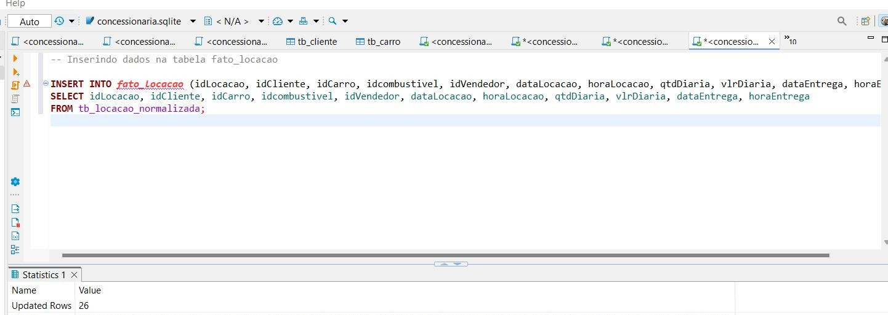

# DESAFIO SPRINT 2

### Como desafio para a Sprint 2  nos foi proposto a prática de modelagem de dados relacional e dimensional usando SQL. O cerne do desafio é aplicar os conceitos de normalização, ou seja, aplicar formas normais para garantir a integridade dos dados e eliminar redundâncias, para atingir até a terceira forma normal (3FN) e em seguida converter o modelo relacional o qual obtive em um modelo dimensional, estruturando-o com tabelas fato e dimensões. Assim criando um modelo voltado para análise de dados, em que as tabelas fato armazenam transações e as tabelas dimensão fornecem os dados para essas transações.

# Etapa 1: Preparação

Comecei o desafio tomando nota dos documentos e vídeos do desafio. Baixei o arquivo concessionaria.sqlite. 

O que foi pedido no desafio:

- **Normalizar a base de dados**: Aplicar as formas normais na tabela tb_locacao, ou seja, eliminar redundâncias e dependências inadequadas.

- **Criar scripts .sql**: Esses scripts devem conter os comandos SQL mostrando como criei as novas tabelas normalizadas. 

- **Desenvolver um modelo dimensional**: Converter o modelo relacional em um modelo dimensional que tenha o objetivo de analisar dados. 

# Etapa 1.1 Preparando o ambiente

# Etapa 1.2

## Aqui comecei a estudar o banco de dados, estudei os dados contidos na tb_locacao. Usei o  como SGBD principal para executar todo o trabalho do desafio, e usei o Sqlite Studio com a tb_locacao conectada apenas para não me perder com os dados.

# Etapa 1.3 Planejamento 

## Fiz uma tabela no excel para me organizar. Estudei os dados da tabela, o seus tipos, quais seriam redundantes, qual a melhor configuração de tabelas ou que mais fariam sentido, e como começar a aplicar as formas normais.

# ETAPA 2: NORMALIZAÇÃO

### Etapa 2.1: Aqui comecei o processo de normalização da tb_locacao aplicando as formas normais

### - **Primeira Forma Normal (1FN)**: não pode haver grupos de repetição ou colunas com valores diversos e os dados tem que estar organizados de forma a garantir atomicidade.

### - **Segunda Forma Normal (2FN)**: todos os atributos que não são chaves devem depender completamente da PK.

### - **Terceira Forma Normal (3FN)**: atributos não são chaves não podem depender de outros atributos que também não são chaves.

### Constatei que a tabela tb_locacao contém 24 colunas, representando dados sobre clientes, carros, vendedores e detalhes das locações. Com o objetivo de obter a forma normal 1FN, trabalhei para que a `tb_locacao` tenha apenas as chaves que referenciam outras tabelas (clientes, carros, vendedores, combustível) e os dados específicos da locação. Com base nisso elaborei as seguintes tabelas: 

- **Cliente**: Os dados do cliente (`idCliente`, `nomeCliente`, `cidadeCliente`, `estadoCliente`, `paisCliente`) se repetem em cada locação, ou seja, posso extrair esses dados para uma tabela separada `Clientes`.
  
- **Carro**: Os dados do carro (`idCarro`, `kmCarro`, `classiCarro`, `marcaCarro`, `modeloCarro`, `anoCarro`) também são repetidas. O único dado que me deixou na dúvida foi kmCarro, pois existem duas kmCarro para um mesmo carro. Discutindo com os colegas, cheguei a conclusão que se eu tivesse que manter as duas, eu teria que criar uma outra tabela (manutenção por exemplo), mas isso fugiria muito do escopo do desafio, então decidi usar a mais recente. 

- **Combustível**: Dados que também tem que ter uma tabela separada (`idcombustivel`, `tipoCombustivel`).

- **Vendedor**: Dados que também tem que ter tabela própria (`idVendedor`, `nomeVendedor`, `sexoVendedor`, `estadoVendedor`).

### Etapa 2.2: Criação da primeira tabela 

### Criei a tabela `tb_locacao_normalizada`, um nome legível e de fácil identificação. Mantive a antiga tabela `tb_locacao` para caso fizesse algum passo errado eu pudesse voltar atrás,Essa tabela possui as chaves estrangeiras que referenciam as novas tabelas criadas: tb_cliente, tb_carro, tb_combustivel, e tb_vendedor. 

[Script-17.sql](../DESAFIO/scripts/Script-17.sql) - Script de criação da tabela `tb_locacao_normalizada`

Imagem da criação da tabela com o script.

### Uma vez criada a tabela, a populei com os dados

[Script-18.sql](../DESAFIO/scripts/Script-18.sql) - Script para popular a `tb_locacao_normalizada`

### Fiz uma consulta simples para verificar se a tabela foi populada corretamente 

[Script-19.sql](../DESAFIO/scripts/Script-19.sql) - Script para consulta simples

### Etapa 2.3: Criação das tabelas dimensionais 

### 2.3.1 Criação das tabelas `tb_cliente`, `tb_carro`, `tb_combustivel` e `tb_vendedor`. Não eliminei a `tb_locacao` exatamente para facilitar popular as tabelas.

[Script-21.sql](../DESAFIO/scripts/Script-21.sql) - Script de criação das tabelas dimensionais

Imagem da criação da tabela com o script.

### 2.3.2 Populando as tabelas `tb_cliente`, `tb_carro`, `tb_combustivel` e `tb_vendedor`.

[Script-22.sql](../DESAFIO/scripts/Script-22.sql) - Script de criação das tabelas dimensionais

Imagem da criação da tabela com o script.

### 2.3.3 Aqui ao abrir a `tb_carro` no View Data, descobri que os dados não estavam inseridos, para confirmar essa minha suspeita, eu fiz uma consulta onde confirmei minha suspeita.

Imagem da consulta.

### 2.3.4 Eu tinha executado anteriormente o script para criação das tabelas, mas para estudar melhor algumas tabelas, executei o script por trecho de código. Como nunca havia trabalhado com o Dbeaver, desconfiei que talvez eu tivesse executado o script inteiro uma segunda vez, causando duplicata de dados. Para confimar eu executei uma consulta para esse fim. Acabei confirmando minha desconfiança.

[Script-28.sql](../DESAFIO/scripts/Script-28.sql)

Imagem da consulta das duplicatas.

### 2.3.5 O erro relacionado na `tb_carro` (SQLITE_CONSTRAINT_PRIMARYKEY) significa que existem duplicatas de idCarro, e o Dbeaver está tentando inserir mais de um registro com o mesmo idCarro, o que não é permitido pela restrição de Primary Key.

[Script-25.sql](../DESAFIO/scripts/Script-25.sql)

Imagem do código

### 2.3.6 Modifiquei o código para encontrar o valor máximo, mas continuei tendo o erro de chave primária duplicada na tabela tb_carro, o que indica que, mesmo com a seleção de MAX(kmCarro), ainda há duplicatas ou problemas de inserção. 

[Script-29.sql](../DESAFIO/scripts/Script-29.sql)

Imagem do script

### 2.3.7 Tentei deletar a tabela `tb_carro` para remover todos os dados da tabela tb_carro, garantido que não terei mais duplicatas, para em seguida eu reinserir tudo novamente. 

### 2.3.8 Tentei inserir novamente (para fins práticos não colocarei novamente os prints dessas 6 tentativas) e sempre recebia o alerta : SQL Error [19]: [SQLITE_CONSTRAINT_PRIMARYKEY] A PRIMARY KEY constraint failed (UNIQUE constraint failed: tb_carro.idCarro). Precisei reiniciar o computador, e ao reiniciar o Dbeaver i o Dbeaver os dados apareceram corretamente na na tb_carro. Pesquisando sobre o ocorrido, cheguei as respostas de que ou houve uma uma falha temporária de sincronização ou travamento no banco de dados SQLite. Mas não consegui confirmar nenhuma delas.

### 2.3.9 Iria realizar a normalização para a Segunda Forma Normal (2FN), mas como executei a separação dos dados relacionados a clientes, carros, combustíveis e vendedores em tabelas próprias, concluí que a tabela tb_locacao_normalizada já está na 2FN, pois a tabela tb_locacao_normalizada contém apenas os dados relacionados diretamente à locação, e removi as dependências parciais quando criei as tabelas relacionadas. Também concluí que não era necessário a normalização para a 3FN, pois se entendi bem o conceito dessa normalização, não existe dados com dependência transitiva nas tabelas, findando a etapa de normalização das tabelas.

# ETAPA 3: Estrutura final e consultas

### Etapa 3.1: Estudando a estrutura da tabela original e das tabelas que criei, cheguei na conclusão de que os dados de `tb_locacao_normalizada` seriam dados de acontecimentos (fatos) como por exemplo a locação, ou seja, seria necessária a criação de uma tabela fato. Outra informação que me fez ir nessa linha de raciocínio é o argumento de alguns livros de que a tabela fato é necessária quando existe a necessidade de criar tabelas dimensionais. Apesar de que é possível fazer consultas diretamente nas tabelas dimensionais, sem a tabela fato isso seria feito de forma mais complexa. Ou seja, pensei também na praticidade de uma tabela fato. 

### Etapa 3.2: Criação da tabela fato `fato_locacao`

### A tabela fato foi criada para armazenar os fatos que ocorrem. Cada linha na tabela fato representa uma locação de carro e inclui informações sobre a data por exemplo. Evito com ela também de replicar informações em outras tabelas, o que aumentaria a redundância e o risco de inconsistências. Com a tabela fato, reduzo duplicação de dados, pois esses dados ficam separados nas tabelas dimensionais.

[Script-32.sql](../DESAFIO/scripts/Script-32.sql)

Imagem do script da criação da tabela fato

### Inserindo dados na tabela fato

[Script-33.sql](../DESAFIO/scripts/Script-33.sql)

### Etapa 3.3: Criação de uma tabela dimensional

### Aqui crio uma tabela dimensional `dimensao_carro`, a qual contém todos os dados que dão forma ao objeto carro. Dados que são incógnitas, que variam ou de qualquer outra natureza que não seja estática são excluídos. Um exemplo é o dado kmCarro, excluí ele da tabela porque é uma métrica variável, que se altera ao longo do tempo e seria mais útil em uma tabela fatos.

[Script-42.sql](../DESAFIO/scripts/Script-42.sql)

### Etapa 3.4: Consultando os dados nas tabelas criadas

### Com as tabelas devidamente criadas, agora posso fazer consultá-las e produzir pesquisas.

### Consulta a tabela dimensao_carro

[consulta_01.csv](/DESAFIO/csv/consulta_01.csv) - Arquivo .csv produzido com a consulta

[Script 41](/DESAFIO/scripts/Script-41.sql) - Script da consulta

### Consulta a tabela fato `fato_locacao`

[consulta_01.csv](/DESAFIO/csv/consulta_02.csv) - Arquivo .csv produzido com a consulta

[Script 34](/DESAFIO/scripts/Script-34.sql) - Script da consulta

### Etapa 3.5: Diagrama DER

#### Aqui o diagrama DER da estrutura do meu banco. Os relacionamentos no diagrama são do tipo Foreign Key, mostrando como que a tabela tb_locacao_normalizada se conecta a outras tabelas para obter informações. Cada campo de FK, como por exemplo idCliente, aponta para a Primary Key correspondente em outras tabelas (tb_cliente, tb_carro, dimensao_vendedor, tb_combustivel), permitindo que a tabela tb_locacao centralize as informações relacionadas, evitando assim a redundância dos dados, que era o meu principal objetivo. 

)

