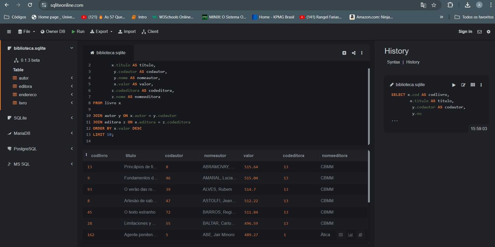
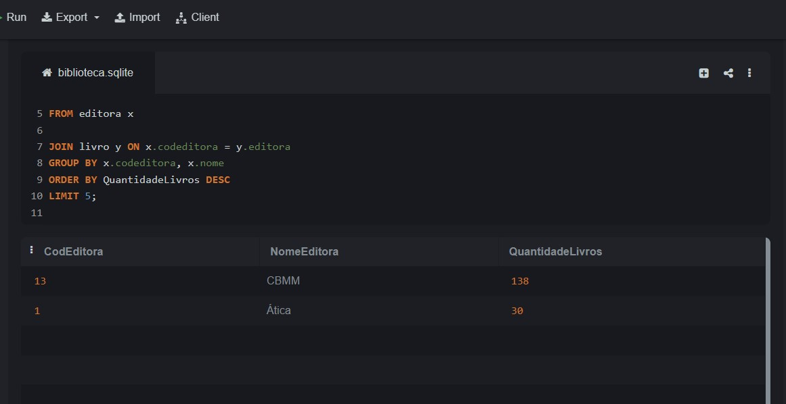
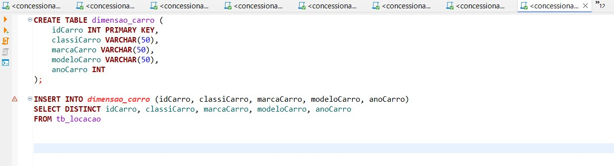
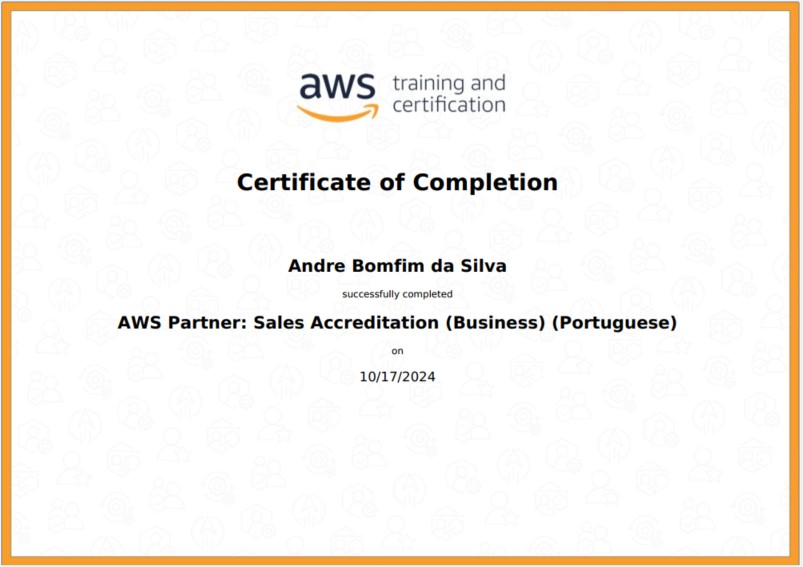

# SPRINT 2

Nesta segunda sprint estudamos através da trilha de estudos conceitos  fundamentais sobre **Data & Analytics** como: banco de dados, tabelas relacionais, dimensionais, ETL, ELT, comandos SQL, Data Lake. Executei 16 exercícios sobre comandos SQL, além de praticar a extração dos dados para tabelas em formato .csv.
Também fiz um curso de AWS Partner Sales Accreditation Business com certificado.

# 1. Exercícios

## 1.1 Exercícios Seção 3:

### Exercício 1 
[E01.sql](EXERCICIOS/Secao_3/E01.sql)

### Exercício 2
[E02.sql](EXERCICIOS/Secao_3/E02.sql)

### Exercício 3
[E03.sql](EXERCICIOS/Secao_3/E03.sql)

### Exercício 4
[E04.sql](EXERCICIOS/Secao_3/E04.sql)

### Exercício 5
[E05.sql](EXERCICIOS/Secao_3/E05.sql)

### Exercício 6
[E06.sql](EXERCICIOS/Secao_3/E06.sql)

### Exercício 7
[E07.sql](EXERCICIOS/Secao_3/E07.sql)

## Exercícios Seção 4:

### Exercício 8 
[E08.sql](EXERCICIOS/Secao_4/E08.sql)

### Exercício 9
[E09.sql](EXERCICIOS/Secao_4/E09.sql)

### Exercício 10 
[E10.sql](EXERCICIOS/Secao_4/E10.sql)

### Exercício 11
[E11.sql](EXERCICIOS/Secao_4/E11.sql)

### Exercício 12
[E12.sql](EXERCICIOS/Secao_4/E12.sql)

### Exercício 13 
[E01.sql](EXERCICIOS/Secao_4/E13.sql)

### Exercício 14 
[E14.sql](EXERCICIOS/Secao_4/E14.sql)

### Exercício 15 
[E15.sql](EXERCICIOS/Secao_4/E15.sql)

### Exercício 16
[E16.sql](EXERCICIOS/Secao_4/E16.sql)

## Exercícios Seção 6: Entregas

### Exercícios Seção 6 Etapa 1

#### Código do exercício
[Código SQL](EXERCICIOS/Secao_6/etapa_1/etapa1.sql)

#### Arquivo .csv do exercício
[Arquivo .csv](EXERCICIOS/Secao_6/etapa_1/etapa1.csv)

#### Imagem da execução do exercício

### Exercícios Seção 6 Etapa 2

#### Código do exercício
[Código SQL](EXERCICIOS/Secao_6/etapa_2/etapa_2.sql)

#### Arquivo .csv do exercício
[Arquivo .csv](EXERCICIOS/Secao_6/etapa_2/etapa_2.csv)

#### Imagem da execução do exercício

# 2. Evidências

## Evidência: Tabela dimensional criada no decorrer do desafio. Explico em detalhes a realização do desafio no [README](/DESAFIO/README.MD) do Desafio 2.

# 3. Certificados

#### Certificado do curso AWS Partner Sales Accreditation Business

