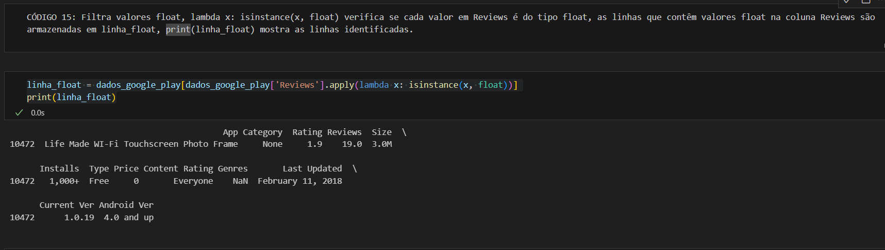
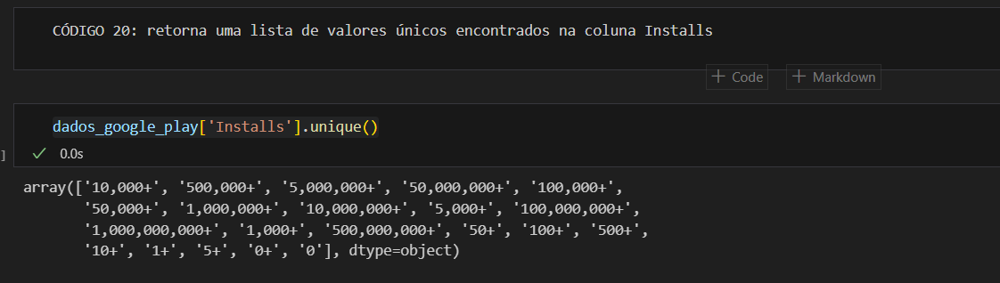
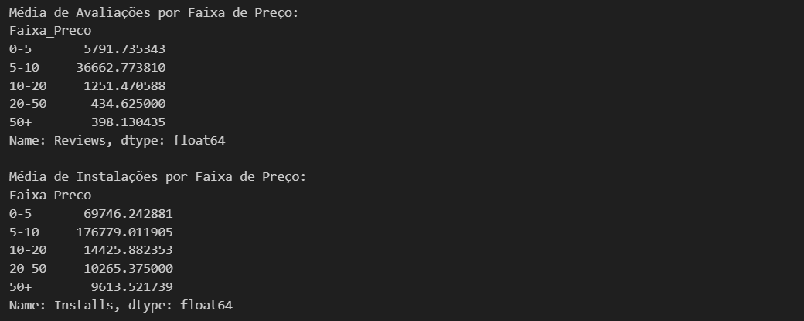
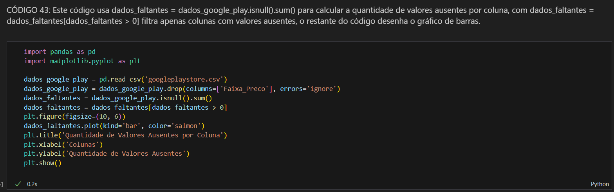

# DESAFIO SPRINT 3

### O objetivo do desafio é ler o arquivo de estatísticas da loja do Google googleplaystore.csv, processá-lo e gerar gráficos de análise. Para isso é necessário seguir as instruções no subitem 4.2, onde são informados os passos a se seguir para atingir esse objetivo. Existem passos subentendidos que cabe a mim realizar, como por exemplo padronização dos dados. Segue.

# Etapa 1: Preparação

### Realizei o download do arquivo googleplaystore.csv e configurei o ambiente Vs Code conforme pedido.

# Etapa 2: Desenvolvimento do Desafio

#### Para facilitar o trabalho no desenvolvimento do desafio e também para aproveitar a praticidade do Jupiter Notebook, reparti meus códigos em várias partes, otimizando muito o trabalho em caso de algum erro. E também permitindo que a documentação do que eu realizei fique clara. 

## Etapa 2.1 Carregando o dataset ‘googleplaystore.csv’

#### Código 01: Com esse código eu importo as bibliotecas requeridas pelo enunciado do desafio e carrego o dataset  googleplaystore.csv para começar a trabalhar nele.

#### Código 02: Neste código eu já carreguei o dateset, e começo a analisá-lo. O resultado dessa análise são 10841 linhas (contando o cabeçalho) e 13 colunas.

#### Código 03: Aqui já consigo ter uma visão mais clara das estruturas do dataset. Como resultado tenho:

- A lista das colunas com seus nomes.
- O tipo de dados de cada coluna
- Quantos valores não nulos existem em cada coluna. 

Tenho muitos valores como object, ou seja, são tipos misturados de valores. A partir de agora já tenho consciência de que preciso fazer uma limpeza nesse sentido em todas as colunas.

#### Código 04: Neste código consigo saber o nome exato das colunas para filtrar dados, realizar operações ou ate´mesmo renomeá-las, e também verificar se há nomes de colunas com erros, caracteres especiais,  espaços em branco, NaN as quais eu vou precisar ajustar antes de realizar análises.

#### Código 05: Para conseguir ter uma visão mais precisa de como esses dados estão representados, vou conferir as 5 primeiras linhas do dataset. Não vi necessidade de ver muito mais que isso.

#### Código 06: A mesma coisa, mas analisando as 5 últimas linhas. Os dados conferem com o resultado de dados_google_play.shape. Tem 10840 linhas (sem contar o cabeçalho).

## Etapa 2.3 – Limpando os Dados

#### A partir daqui iniciarei a análise de cada coluna do dataset, já iniciando o processo de limpeza e padronização dos dados.

## Etapa 2.3.1 – Limpeza e padronização da coluna Category

##### Essa coluna diz respeito aos nomes das categorias dos apps, ou seja, presume-se que existirão apenas dados do tipo string, pois as categorias devem ter apenas nomes. 

#### Código 07: Este código retorna uma lista de valores únicos encontrados na coluna Category do dataframe. Como se nota, são todos do tipo object, mas tem um “1.9”. Analiso se isso pode ser realmente um nome de categoria ou se pode ser um valor que foi digitado errado ou um erro deoutra natureza.

#### Código 08: o código filtra o dataframe para mostrar apenas as linhas em que o valor na coluna Category é exatamente '1.9'. A princípio, a coluna Category deve conter apenas as categorias de aplicativos e não números. Esse tipo de valor numérico nessa coluna indica que pode haver dados sujos ou incorretamente classificados no dataset. 

#### Ao analisar o restante dos dados, percebo que os dados parecem não fazer sentido. Por exemplo Last Update tem um dado de versão de app e Genres tem uma dado de data. Ou seja, o dado “1.9” foi indevidamente inserido de alguma forma, deslocando todos os outos dados para a direita. Isso provavelmente é um erro de entrada. 

#### Código 09:  Aqui ajusto a linha 10472 no dataframe  onde os dados estavam desalinhados. Movo todos os valores dessa linha uma coluna para frente, corrigindo o posicionamento incorreto dos dados, depois redefino o valor na coluna App com o valor que estava em Category, restaurando o valor correto do nome do aplicativo. Para finalizar, como não podia usar a Numpy, eu defino o valor de Category como None, representando um valor ausente (NaN), o que corrige o erro causado pelo valor 1.9 incorreto em Category, assim restauro a consistência do dataset.

#### Abaixo da execução do código tem um aviso do Pandas porque o código tem valor incompatível em uma coluna, mas por enquanto vou ignorá-lo, pois vou converter tudo de uma vez em um etapa posterior.  

#### Código 10: Este trecho exibe todos os valores da linha 10472 de forma que eu possa conferir as modificações. Aqui  confirmo que os dados estão corretamente inseridos e alinhados, e que o valor incorreto em Category foi substituído por None (NaN).

## Etapa 2.3.2 – Limpando e padronizando a coluna Rating

#### Código 11: Aqui confirmo a consistência dos dados de coluna Rating. O valor '1.9' está comomo texto, o que confirma a inconsistência de tipos de dados na coluna, que deveria conter apenas valores numéricos. 

#### Código 12: neste código converto a coluna Rating para o tipo float64, substituindo valores não numéricos por NaN. Isso faz com que os dados tenham um único tipo garantindo que a coluna contenha apenas valores numéricos. O dtype(‘float64’) confirma a conversão.

## Etapa 2.3.3 – Limpando e padronizando a coluna Reviews

#### Código 13:  retorna uma lista de valores únicos encontrados na coluna Reviews. Os dados aqui também estão como object.

#### Código 14: Esse código filtra valores não numéricos na coluna Reviews e exibe os valores inconsistentes. Aqui, como descrito, ele mostra que os valores em Reviews ainda estão no tipo object (indicativo de strings ou uma mistura de tipos). Preciso converter toda a coluna para valores numéricos e garantir que valores não numéricos sejam substituídos por NaN.

#### Código 15: Identifiquei que a mesma linha 10472, ela ainda possui um valor float na coluna Reviews. 

#### Código 16: código onde converto a coluna Reviews para o tipo float64. 

## Etapa 2.3.3 – Limpando e padronizando a coluna Size

#### Código 17: este código retorna todos o valores que são muitos em Size. A lista fica truncada em determinado tamanho. O tipo de dado de Size é object. Como se vê, os números tem sufixos, o que atrapalha na análise.

#### Código 18: os tamanhos de aplicativos estão expressos em megabytes (M) e kilobytes (k), e também no valor "Varies with device". É necessário converter esses tamanhos para um dado numérico e padronizá-los, e para padronizá-los preciso convertê-los para o formato numérico float. Também vou remover os sufixos (M e k) e converter os tamanhos para megabytes, e substituir o valor "Varies with device" por None (NaN). 

#### Código 19:Faço um novo dados_google_play['Size'].unique() para conferir os dados. Agora estão todos padronizados. 

## Etapa 2.3.3 – Limpando a coluna Installs

#### Código 20: Aqui também terá um processo semelhante a coluna anterior. Preciso tratar o tipo e padronizar retirando o sufixo “+”.

#### Código 21: este código limpa e converte a coluna Installs para o tipo float, removendo vírgulas e o símbolo +, além de substituir o valor "Free" por None. Em seguida, converte a coluna para float. O tipo de dado é confirmado como float64.

#### Código 22: faço novamente unique() para conferir se os dados estão corretos.

## Etapa 2.3.3 – Limpando e padronizando a coluna Price

#### Código 23:  Faço uma lista dos valores distintos em Price.

#### Código 24: este código limpa e converte a coluna Price para o tipo float, substituindo "Everyone" por None e removendo o símbolo $. Em seguida, transforma os valores para float. O tipo de dado final é confirmado como float64. 

## Etapa 2.3.4 – Limpando e padronizando a coluna Last Update

#### Código 25: essa coluna possui dados de atualização dos apps e eles estão armazenados como strings (dtype=object). Para realizar análises o melhor é que os dados sigam o padrão do tipo datetime.

#### Código 26: O código dados_google_play['Last Updated'] = pd.to_datetime(dados_google_play['Last Updated']) converte a coluna Last Updated para o tipo datetime, atualizando os dados para o padrão YYYY-MM-DD, o que deixa tudo mais prático e elimina a possiblidade de erros. 

## Etapa 3 – Aqui começo a execução do que é pedido no item 4.2 Etapa 2: Desenvolvimento

Na trilha de estudos, na Seção 6, item 4, no texto são pedidos os seguintes trabalhos para se considerar o desafio concluído, a saber: 

1. Leia o arquivo csv googleplaystore.csv e realize a seguinte atividades sobre o dataset utilizando as bibliotecas Pandas e Matplotlib. Remova as linhas duplicadas

2. Faça um gráfico de barras contendo os top 5 apps por número de instalação.

3. Faça um gráfico de pizza (pie chart) mostrando as categorias de apps existentes no dataset de acordo com a frequência em que elas aparecem.

4. Mostre qual o app mais caro existente no dataset 

5. Mostre quantos apps são classificados como 'Mature 17+' 

6. Mostre o top 10 apps por número de reviews bem como o respectivo número de reviews. Ordene a lista de forma decrescente por número de reviews.

7. Crie pelo menos mais 2 cálculos sobre o dataset e apresente em formato de lista e outro em formato de valor. Por exemplo: "top 10 apps por número de reviews" e “o app mais caro existente no dataset”.

8. Crie pelo menos outras 2 formas gráficas de exibição dos indicadores acima utilizando a biblioteca matplotlib. Escolha tipos de gráficos diferentes dos explorados acima. Por exemplo: linhas e dispersão.

## Etapa 3.1 – Item 1. Leia o arquivo csv googleplaystore.csv e realize a seguinte atividades sobre o dataset utilizando as bibliotecas Pandas e Matplotlib. Remova as linhas duplicadas

A etapa 2 e suas subetapas logo acima já englobam a primeira parte desse pedido. Falta agora apenas remover as linhas duplicadas.

O dataset tem muitos registros de apps que estão aparentemente duplicados, diferindo apenas pelo número de Reviews, o que mostra que apenas essa coluna foi sendo atualizada. Pode ser que existiam outras colunas ou até mesmo um arquivo a parte onde se possa fazer uma análise quantitativa ou qualitativa desses dados do Review. 

Como não tenho essa informação, e subentende-se que não se deve buscar dados além do googleplaystore.csv, decidi remover as linhas duplicadas baseando-me no critério de deixar no dataset as linhas com os maiores Reviews. O restante será excluído.

#### Código 27: O código ordena  `dados_google_play` para priorizar linhas com maior valor em `Reviews`, remove duplicatas na coluna `App` e mantém apenas a primeira ocorrência de cada aplicativo. Em seguida, exibe o número de linhas restantes, garantindo que cada aplicativo apareça uma vez, com a maior contagem de avaliações.

#### Das 10840 linhas, foram removidas 1179 linhas, resultando em 9659 linhas distintas. Portanto, o objetivo do Item 1 está concluído.

#### Codigo 28: Como ao deletar as duplicadas o index ficou desorganizado, preciso os reorganizar novamente para que tudo fique da forma mais íntegra e organizada possível, e mostro as 5 primeiras linhas e 5 últimas linhas para verificar se tudo está ok.

#### Código 29: Para facilitar a confecção de gráficos e cálculos, aproveitei e fiz a matriz de correlação entre colunas numéricas com o objetivo de identificar o relacionamento das variáveis. A correlação me permite ver de forma mais clara a interação entre os dados do dataset.

## Etapa 3.2 – Item 2. Faça um gráfico de barras contendo os top 5 apps por número de instalação.

#### Código 30: Selecionei os 5 apps, mas eles estavam retornando empatados, eu já tinha percebido que tinham muitos app com mais de 1 bilhão. Então fiz um código que seleciona os 50 aplicativos com o maior número de instalações, mostrando apenas as colunas App e Installs. Ele usa nlargest para identificar os mais instalados e exibe o resultado. Mesmo assim muitos estão empatados.

#### Código 31: Decidi testar o gráfico de barras para analisar o resultado. Aqui vejo que o resultado não é algo que possa ser útil. Vou ter que procurar uma saída razoável e que traga uma visualização que faça sentido.  

#### Código 32: Como a primeira versão do gráfico ficou muito ruim, decidi adotar um critério de desempate que fizesse sentido na análise. Para isso consultei a tabela de correlações (Código 29), onde verifiquei uma boa correlação entre Reviews e Installs (0.625).

#### O número de Reviews indica que o app com mais avaliações geralmente têm uma base de usuários ativa maior.

#### Agora o gráfico ficou mais contextualizado e com um sentido prático. Portanto o objetivo do “Item 2. Faça um gráfico de barras contendo os top 5 apps por número de instalação.” foi executado.

## Etapa 3.3 – Item 3. Faça um gráfico de pizza (pie chart) mostrando as categorias de apps existentes no dataset de acordo com a frequência em que elas aparecem.

#### Código 32: O código cria um gráfico de pizza para visualizar a distribuição das categorias de aplicativos no dataset dados_google_play. Ele calcula a frequência de cada categoria e exibe as proporções no gráfico com rótulos e porcentagens. Como são muitas categorias, elas acabam se sobrepondo umas as outras, deixando o gráfico sujo e sem utilidade.

#### Código 33: Para melhorar e facilitar uma análise, criei um código onde gráfico de pizza destaca as 5 categorias principais de aplicativos e agrupando as demais em "Outros". Ele combina essas categorias e aplica bordas e um efeito de "explosão" para melhorar a visualização. Agora o gráfico fica mais limpo e de fácil leitura.

#### Agora o gráfico ficou mais limpo e otimizado, de fácil leitura. Portanto o objetivo do “ Item 3. Faça um gráfico de pizza (pie chart) mostrando as categorias de apps existentes no dataset de acordo com a frequência em que elas aparecem.” foi executado.

## Etapa 3.4 – Item 4. Mostre qual o app mais caro existente no dataset

#### Código 34: Este código encontra e exibe o aplicativo mais caro no dataset dados_google_play, excluindo os aplicativos gratuitos. Dados assim são interessantes análises de mercado, sendo que ele me levou a ter ideias para os itens posteriores.

#### Código 35: Este código tem função apenas visual, onde crio um card para mostrar o aplicativo mais caro. Tem objetivo meramente de exercício e não foi pedido no desafio. 

#### Isto posto, o objetivo do "Item 4. Mostre qual o app mais caro existente no dataset" foi executado.

## Etapa 3.5 – Item  5. Mostre quantos apps são classificados como 'Mature 17+'

#### Código 36: Este código conta o total de aplicativos no dataset, filtra para contar apenas aqueles classificados como "Mature 17+" e calcula a porcentagem em relação ao total. 

#### Código 37: Para deixar a análise mais visual, e exercitar a análise, coloquei esse dado em contexto mais visual usando um gráfico de pizza.

#### Isto posto, o objetivo do "Item  5. Mostre quantos apps são classificados como 'Mature 17+'" foi executado.

## Etapa 3.6 – Item 6. Mostre o top 10 apps por número de reviews bem como o respectivo número de reviews. Ordene a lista de forma decrescente por número de reviews.

#### Código 38: neste código seleciono os 10 maiores valores na coluna "Reviews". A função nlargest(10, 'Reviews') busca as 10 linhas com as maiores contagens de avaliações. O resultado está organizado de forma decrescente pela ordem da quantidade de Reviews.

#### Isto posto, o objetivo do "Item 6. Mostre o top 10 apps por número de reviews bem como o respectivo número de reviews. Ordene a lista de forma decrescente por número de reviews." foi executado.

## Etapa 3.7 – Item 7. Crie pelo menos mais 2 cálculos sobre o dataset e apresente em formato de lista e outro em formato de valor. Por exemplo: "top 10 apps por número de reviews" e “o app mais caro existente no dataset”.

#### Código 39: Meu cálculo escolhido é analisar aplicativos que são caros, com preço acima da média e  e têm uma "péssima avaliação. Tive essa ideia ao desenvolver o Código 34.

#### Este código identifica aplicativos com preço acima da média e avaliação abaixo de 3.0, indicando baixa aceitação. O 3.0 foi escolhido mas pode ser outro valor. Ele calcula o preço médio e filtra os aplicativos que atendem a esses critérios. Em seguida, exibe o nome, preço e avaliação desses aplicativos. 

#### Código 39a: Este código calcula a quantidade e filtra as colunas com valores ausentes, seja NaN ou None. 

#### Como o desafio não dá nenhuma orientação ou contexto sobre a finalidade da análise, a melhor saída é deixar os valores ausentes, pois podemos poupar recursos de processamento ou futuramente podemos até mesmo preencher os valores ausentes usando métodos de imputação como a média, mediana, moda ou até valores específicos com base em outras informações.

#### Código 40: Meu cálculo escolhido baseado em valor é mediana da coluna Reviews.

#### Isto posto, o objetivo do "Item 7. Crie pelo menos mais 2 cálculos sobre o dataset e apresente em formato de lista e outro em formato de valor. Por exemplo: "top 10 apps por número de reviews" e “o app mais caro existente no dataset”" foi executado.

## Etapa 3.8 – Item 8. Crie pelo menos outras 2 formas gráficas de exibição dos indicadores acima utilizando a biblioteca matplotlib. 

#### Como neste item foi dado como exemplo gráfico de linhas e de dispersão, decidi seguir o conselho para me concentrar na elaboração dos gráficos.

#### Código 41: Seguindo o raciocínio do item 7, este código cria um gráfico de dispersão para analisar a relação entre preço e avaliação dos aplicativos que são caros e possuem avaliação baixa. 

#### Código 42: Antes de mais nada cabe ressaltar que este código não é meu. É uma ideia que tinha visto na matéria de Javascript na faculdade, e resolvi resgatar e aplicar aqui a título de teste. Adaptei ao meu caso com a ajuda do chat gpt, sendo que o original está em https://www.youtube.com/watch?v=-rDhoeig450

#### Eu havia testado um gráfico de linhas simples, mas o resultado foi muito ruim, tanto é que não vou inserí-lo aqui. Então achei que faria mais sentido usar a combinação de linha com barras.

#### Este código analisa a média de avaliações (Reviews) e instalações (Installs) por diferentes faixas de preço no DataFrame dados_google_play e exibe os resultados em um gráfico combinado de barras e linhas. 

#### Código 43: este código mostra em gráfico o cálculo do Código 39a. Ele cria um gráfico de barras da quantidade de valores ausentes por coluna. 

#### Isto posto, o "Item 8. Crie pelo menos outras 2 formas gráficas de exibição dos indicadores acima utilizando a biblioteca matplotlib" foi executada.

## Etapa 4 – Conclusão

#### De acordo com o que já expus na “Etapa 3 – Execução do que é pedido no item 4.2 Etapa 2: Desenvolvimento” aqui exponho minhas entregas.

1. Leia o arquivo csv googleplaystore.csv e realize a seguinte atividades sobre o dataset utilizando as bibliotecas Pandas e Matplotlib. Remova as linhas duplicadas

- Status: Entregue.

2. Faça um gráfico de barras contendo os top 5 apps por número de instalação.

- Status: Entregue.

3. Faça um gráfico de pizza (pie chart) mostrando as categorias de apps existentes no dataset de acordo com a frequência em que elas aparecem.

- Status: Entregue.

4. Mostre qual o app mais caro existente no dataset

- Status: Entregue.

5. Mostre quantos apps são classificados como 'Mature 17+'

- Status: Entregue.

6. Mostre o top 10 apps por número de reviews bem como o respectivo número de reviews. Ordene a lista de forma decrescente por número de reviews.

- Status: Entregue.

7. Crie pelo menos mais 2 cálculos sobre o dataset e apresente em formato de lista e outro em formato de valor. Por exemplo: "top 10 apps por número de reviews" e “o app mais caro existente no dataset”.

- Status: Entregue.

8. Crie pelo menos outras 2 formas gráficas de exibição dos indicadores acima utilizando a biblioteca matplotlib.

- Status: Entregue.

#### Entregáveis segundo o item 2 da Seção 6: arquivo .IPYNB contendo o código no modelo notebook com as execuções realizadas e células em markdown com a documentação de cada célula de código criada.

[Meu script no formato .IPYNB](../DESAFIO/script1.IPYNB)

#### Diante de tudo exposto no presente documento, dou por finalizado o desafio da Sprint 3.

