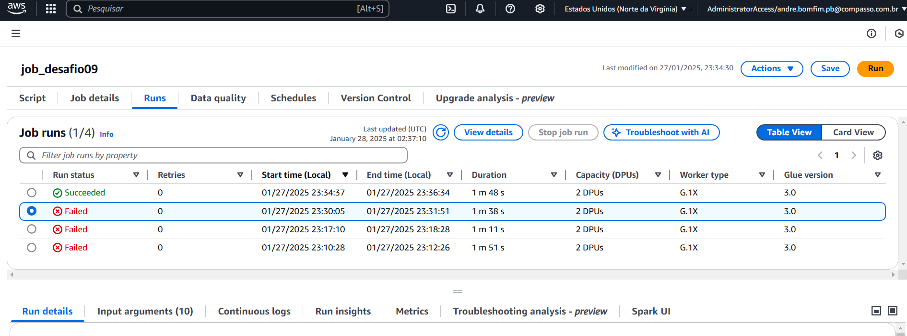

# DESAFIO SPRINT 9

#### Nesta nona sprint, a tarefa é estruturar os dados da Camada Refined do Data Lake para que fiquem já no formato próprio para analisar no QuickSight. Os dados são oriundos da Trusted Zone e precisam ter uma modelagem dimensional (coisa que já fiz na sprint 2) criando tabelas no AWS Glue Data Catalog. O processamento será feito com Apache Spark, onde vou transformar e armazenar tudo no formato .parquet, tudo já estruturado para visualização.

#### Meu modelo tem o objetivo de organizar os dados para responder as perguntas que elaborei relacionadas a filmes e séries de Drama e Romance. A estrutura é baseada na tabela fato e nas dimensões, que me ajudarão a analisar dados sobre gêneros, produtoras, países, elencos e popularidade.

#### No decorrer das sprints percebi que o melhor a se fazer era simplificar o máximo as minhas perguntas. Eu queria usar APIs externas e usar mais databases, mas o projeto foi ficando complexo demais, e como o tempo era curto, resolvi simplificar ao máximo as análises. O item 3 abaixo (Perguntas Comparativas (Filmes vs. Séries)) foi o que mais simplifiquei pois tive muita dificuldade de cruzar os dados.

# Perguntas Reelaboradas

1️⃣ Perguntas sobre Drama e Romance

    • Qual é o tempo médio de duração? 

    • Qual gênero tem maior popularidade média?

    • Quais anos tiveram mais lançamentos? 

2️⃣ Perguntas sobre Produtoras, Países e Elencos

    • Quais produtoras produzem mais Drama ou Romance? 

    • Quais países produzem mais Drama ou Romance?  

    • Quais diretores e atores aparecem mais frequentemente? 

3️⃣ Perguntas Comparativas (Filmes vs. Séries)

    • Popularidade Média 

    • Anos com Mais Lançamentos

    • Atores/Atrizes Mais Frequentes  

# Estrutura

## Tabela Dimensão Gênero (dim_genero)

#### Essa é uma tabela que lista os gêneros que vou trabalhar, (Drama e Romance). Ela permite analisar métricas específicas por gênero, e me facilita a responder por exemplo `Qual é a popularidade média de Drama e Romance?`

## Tabela Dimensão Data (dim_data)

#### Essa tabela que lista as datas de processamento dos dados, é necessária para fazer a localização temporal dos dados. Ela permite agrupar e filtrar por ano, mês ou dia de processamento. Me ajuda a responder por exemplo `Quais anos tiveram mais lançamentos de filmes ou séries?` 

## Tabela Fato (fato_conteudo)

#### Essa é a tabela principal que armazena informações quantitativas e referencia as dimensões. Ela contém métricas importantes como popularidade, avaliação média e número de votos, me permitindo fazer análises cruzando com dados de gêneros, produtoras e datas. 

# Criação das tabelas

# Etapa 1: Criação do Job para criação das tabelas.

# Etapa 2: Código inserido no script do Glue.

### O código completo está aqui: [Código do Job](../DESAFIO/desafio09.py)

# Etapa 3: Execução 4 de 4 bem sucedida.

# Etapa 4: Bucket REFINED com as tabelas devidamente alocadas conforme padrão pedido no desafio.

# Etapa 5: Crawlers criados (por já ter demonstrado essa etapa em sprint anteriores evidencio aqui eles já criados).

# Etapa 6: Tabela com o Diagrama relacional das tabelas criadas.

#### Diante de tudo exposto no presente documento, dou por entregue e finalizado o desafio da Sprint 9.

